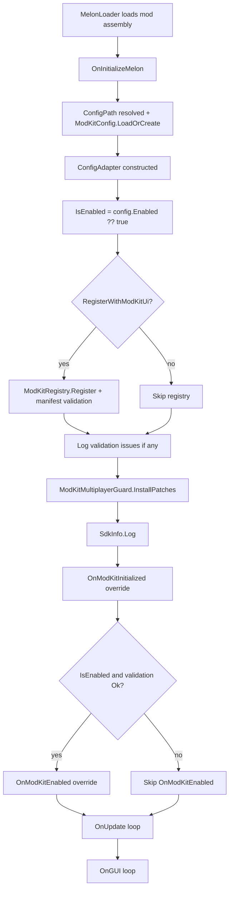
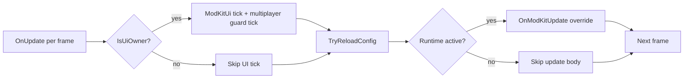
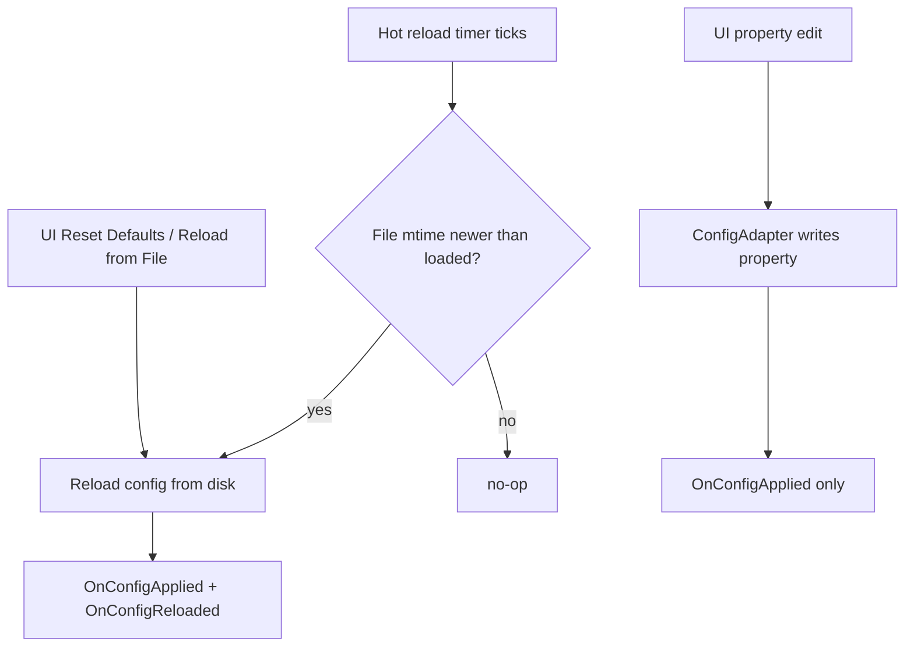

# Lifecycle

`ModKitMelonMod<TConfig>` seals the MelonLoader entry points (`OnInitializeMelon`, `OnUpdate`, `OnGUI`, `OnSceneWasLoaded`) and routes them through framework hooks. Override the `OnModKit*` virtual methods instead — they fire in a predictable order regardless of MelonLoader plumbing changes.

## Order of operations

Once initialization is complete, MelonLoader drives the per-frame loop:

## Config-edit and reload paths

There are three paths that re-apply config to your mod. They all converge on the same overrides so you only need to react in one place.

`OnConfigApplied` fires for every code path. `OnConfigReloaded` fires only when the entire config object is replaced (hot reload, manual reload, reset defaults).

## What each hook is for

| Hook | When it fires | Use it for |
|------|---------------|------------|
| `OnModKitInitialized()` | Once, after registry + multiplayer guard install. | One-time setup (resolving types, wiring `PatchContext<TState>`, setting up `ModKitFileLog`, registering hotkeys). |
| `OnModKitEnabled()` | After init when `IsEnabled` is true and manifest validation passed; and on every transition to runtime-active. | Apply Harmony patches, subscribe to events, start work. |
| `OnModKitDisabled()` | On every transition out of runtime-active. | Unpatch, unsubscribe, stop work. Be idempotent — config edits and self-check reruns can both change runtime state. |
| `OnModKitUpdate()` | Per frame, only while runtime-active. | Polling work. Keep cheap. |
| `OnModKitGui()` | Per OnGUI pass, only while runtime-active. | Custom IMGUI overlays. The ModKit overlay handles config UI for you. |
| `OnConfigApplied(TConfig)` | After any config change applied to runtime. | Push the new values into your runtime objects (cache references, recompute thresholds). |
| `OnConfigReloaded(TConfig prev, TConfig now)` | Hot reload, manual reload, reset defaults. | Diff old vs new for "did this expensive thing change" optimizations. |
| `OnModKitSceneWasLoaded(int, string)` | Scene-load hook, only while runtime-active. | Scene-specific setup. |

## Lifecycle invariants

- `Config` is non-null from the first invocation of any override.
- `Metadata` resolves once and is cached. Reading `Metadata.Id` from any hook is safe.
- `Metadata.Id` equals `ModId` only if you didn't override the `[ModKitManifest(Id = ...)]` value. Prefer `Metadata.Id` everywhere downstream.
- `IsEnabled` reflects the user's intent. Runtime hooks fire only when `ModKitRuntimePolicy.ShouldRun(IsEnabled, ModKitRegistry.IsBlockedByManifest(Metadata.Id))` is true, so manifest-blocked mods remain visible but do not run.
- Hot reload works for any property type the JSON serializer can round-trip. Live UI edits work for `bool`, integer numerics, floating-point numerics, `string`, enums, and `string[]`.
